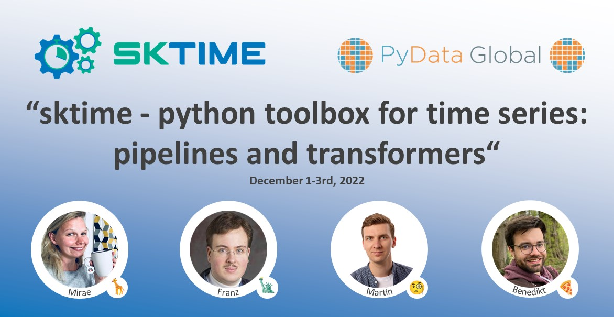

## Abstract:

sktime is a widely used scikit-learn compatible library for learning with time series. sktime is easily extensible by anyone, and interoperable with the pydata/numfocus stack.  sktime has a rich framework for building pipelines across multiple learning tasks that it supports, including forecasting, time series classification, regression, clustering.  This tutorial explains basic and advanced sktime pipeline constructs, and introduces in detail the time series transformer which is the main component in all types of pipelines. It is a continuation of the sktime introductory tutorial at pydata global 2021.

## Agenda:
- We will move through each of the numbered chapters in this repo section by section.
- You should be able to follow along out of the box on Binder.
- Please let us know on slack if you have any issues following along during the synchronous tutorial, or join our community on [sktime slack](https://join.slack.com/t/sktime-group/shared_invite/zt-1jphqjpnk-AfxAR8IEfIVkf4By8cT7tQ) to ask for help if you are walking through this tutorial asynchrounously.

## Other Video Tutorials:

- [PyData 2021 - Intro to sktime](https://www.youtube.com/watch?v=ODspi8-uWgo)

- [Pydata 2022 - How to implement your own estimator in sktime](https://www.youtube.com/watch?v=S_3ewcvs_pg)

- [Pydata 2022 - Advanced Forecasting Tutorial](https://www.youtube.com/watch?v=4Rf9euAhjNc)
